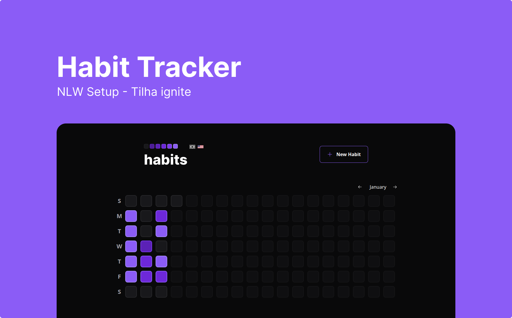

<h2 align="center">Habit tracker</h2>
Projeto desenvolvido durante o evento NLW da rocketseat seguindo a trilha ignite. 

## Sobre
A idéia do projeto é ajudar o usuário na adoção de novos hábitos, registrando seu progresso e disponibilizando uma visualização gráfica. Foi desenvolvido uma api utilizando Fastify + Prisma e um frontend utilizando React + Tailwind.

## Como rodar

 1. Clone este repositório
 2. Navegue para a pasta `web` e instale as dependencias `npm install` depois inicie o servidor com `npm run dev`
 3. Navegue para a pasta `server` e instale as dependencias `npm install` depois inicie o servidor com `npm run dev`
 4. Acesse o endereço local http://127.0.0.1:5173/
